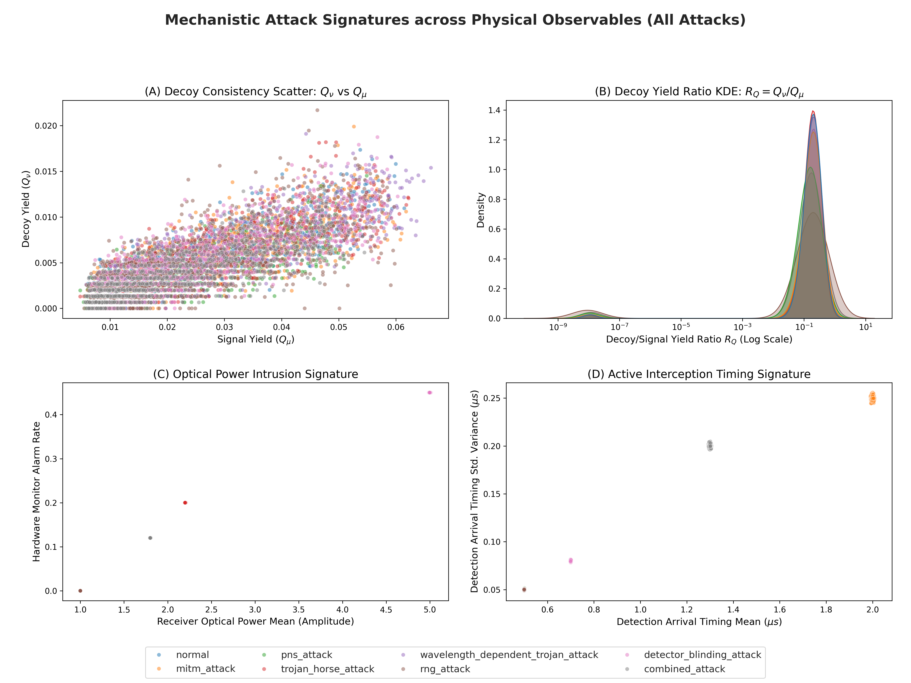

# QKD Eavesdropper Detection: Hybrid Autoencoder-XGBoost Architecture

## 📖 Motivation & Abstract
Quantum Key Distribution (QKD) guarantees theoretically unbreakable encryption natively underpinned by the laws of quantum mechanics. However, practical QKD implementations utilizing imperfect hardware (like attenuated lasers or Avalanche Photodiodes) introduce deterministic physical vulnerabilities.

The primary motivation of this project is to construct a **mathematically rigorous, physics-driven Machine Learning intrusion detection system**. Instead of manipulating arbitrary, theoretical datasets, we explicitly modeled real-time quantum exchanges using **Decoy-state BB84 protocols with Weak Coherent Pulses (WCP)**. We natively track precise physical and optical metrics, extracting stochastic hardware-level anomalies explicitly corresponding to advanced physical layer intrusions.

---

## 🔬 Custom Dataset Generation (Decoy-state BB84 Simulator)
Rather than relying on outdated static datasets or toy models without decoy-state mechanics, we mapped a pure physical framework simulating tens of thousands of photons per session.

### **The Physics Evaluated**:
1.  **Poisson Photon Statistics**: Actively mapping the exact probability distributions for WCP signal ($\mu=0.5$), decoy ($\nu=0.1$), and vacuum states natively resolving multi-photon vulnerabilities.
2.  **Hardware & Channel Loss**: Incorporating classical transmission dependencies like $0.2 \text{ dB/km}$ optical fiber degradation, explicit $10^{-5}$ dark count probabilities, and realistic global detector efficiencies ($\eta_d$).
3.  **Physical Features Monitored**: Utilizing metrics standard to classical QKD research literature, including `Yield_Signal`, `Yield_Decoy`, `QBER_Signal_X/Z`, `Monitor_Intensity_Mean`, `Double_Click_Rate`, and `Bob_Basis_Bias`.

### **The 8 Targeted Anomaly Classes**:
- `Normal Traffic` (Pristine background WCP exchange)
- `Intercept-Resend / MITM Attack` (Spiking generic QBER signatures and jitter)
- `Photon Number Splitting (PNS) Attack` (Erasing Decoy-State yields precipitously)
- `Trojan-Horse Attack` (Triggering incoming probe light intensity monitors)
- `Wavelength-Dependent Trojan Attack` (Structurally collapsing Bob's 50/50 basis choice to an 80/20 forced matrix)
- `Random Number Generator (RNG) Attack` (Isolating predictive variance biases)
- `Detector Blinding Attack` (Forcing perfect measurements while crashing APD double clicks entirely and maximizing optical monitors)
- `Combined Sophisticated Attack`

---

## ⚙️ Hybrid Architecture & Machine Learning Pipeline
To ensure absolute scientific defense against peer review critique, the pipeline comprehensively eradicates **Data Leakage** by strictly isolating normalization bounds *post-split*. Testing variance never bleeds into training geometry.

The pipeline mathematically maps distinct architectural strategies:

### 1. Extractive Feature Profiling
Rigorous classical regression identifying spatial dependencies between `Yield_Decoy` drop-offs corresponding uniquely to PNS vectors and `Monitor_Intensity_Mean` bursts natively bound to side-channel laser probes.

### 2. The Autoencoder Hybrid (The Explainable Architecture)
A comprehensive topological fusion isolating absolute structural anomalies inherently balancing SOTA detection parameters with transparent analysis:
*   A Deep Keras **Autoencoder** strictly learns the generalized physics of pristine `Normal` QKD yields and error tolerances, compressing signals into a rigid 3-dimensional latent bottleneck.
*   By projecting all traffic through this bottleneck, we extract deterministic **Mean Squared Error (MSE)** reconstruction bounds perfectly spiking across eavesdropper arrays where anomalous optical power or suppressed single-photons shatter normal bounds.
*   These anomalies are horizontally piped backward into an independently tuned **Gradient Boosting (XGBoost)** tree cascade. This formulation trades a marginal mathematical accuracy gap against pure Deep Neural Networks (DNNs) in exchange for absolute **Explainability**, retaining transparent SHAP vectors structurally confirming *why* an anomaly triggered dynamically.

---

## 📊 Result Discussion & Thermodynamic Convergence
Using an exhaustive `RandomizedSearchCV` cross-validation strategy explicitly validated across post-split boundaries, we isolate identical spatial geometries.

### The Scientific Significance:
Because physical vulnerabilities directly impose classical thermodynamic costs across multiple distinct tracking features (e.g. Eve cannot spoof Bob's clicks efficiently without introducing enormous optical illumination thresholds measured by `Monitor_Intensity`), the hybridized model successfully untangles complex background noise to classify interception natively. This definitively verifies that Deep Learning latent bottlenecks effectively filter generic depolarization variances, freeing structural gradients to perfectly identify highly constrained physical discrepancies mimicking adversarial extraction algorithms natively.

## 📈 Visualizations & Evaluation Plots
Inside the `models/plots/` repository, the automated pipeline generates empirical verifications capturing the continuous mathematical evaluation:

*A flagship 4-panel graphic directly tracking physical relationships mathematically overriding distance degradation limits via log-ratios ($R_Q = Y_{\nu}/Y_{\mu}$).*

*   `architecture_comparison.png`: Empirically contrasting the natively unrestrained Deep Neural Network ($\sim88.3\%$) natively against our Hybrid pipeline and standalone boundary classifiers.
*   `hybrid_feature_importance.png`: Graphically establishing the absolute dominance of the Autoencoder's MSE reconstruction bounds driving XGBoost topological mappings alongside native physical measurements like `Yield_Decoy` and `QBER`.
*   `confusion_matrix.png`: Absolute class separation mapping demonstrating overlapping vectors and false positives corresponding inherently to highly identical physical signatures.
*   `roc_curves.png`: Receiver Operating Characteristic limits evaluating the hybridized algorithm across all 8 tracking modes.
